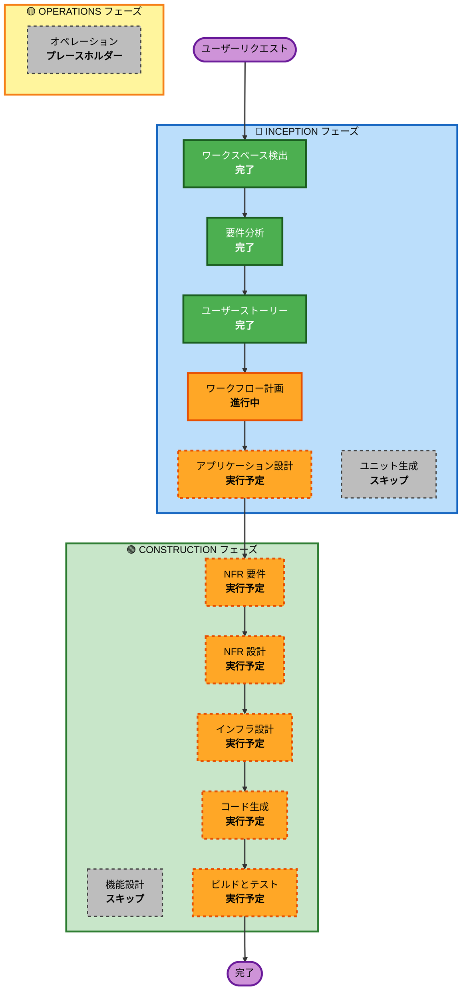

# 実行計画

## 詳細分析サマリー

### プロジェクト概要
- **プロジェクト名**: スヌーズを押せ
- **プロジェクトタイプ**: Greenfield（新規開発）
- **開発期間**: ハッカソン 24 時間
- **デプロイ先**: AWS（サーバレスアーキテクチャ）

### 変更影響評価

#### ユーザー向け変更
**あり** - 新規 Web アプリケーション
- アラーム設定・鳴動・スヌーズ機能
- AI メッセージ生成と表示
- ゲーミフィケーション要素（堕落ゲージ、連続記録）
- ハッカソンデモシナリオ

#### 構造的変更
**あり** - 新規システムアーキテクチャ
- サーバレスアーキテクチャ（Lambda + API Gateway）
- フロントエンド（React/Next.js）
- AI 統合（Amazon Bedrock）
- データ永続化（DynamoDB + ローカルストレージ）

#### データモデル変更
**あり** - 新規データモデル
- アラーム設定データ
- スヌーズ記録データ
- ユーザー記録データ（堕落ゲージ、連続日数、称号）
- メッセージ履歴データ

#### API 変更
**あり** - 新規 API
- AI メッセージ生成 API
- スヌーズ記録保存 API
- ユーザー記録取得 API

#### NFR 影響
**あり**
- パフォーマンス: AI メッセージ生成 5 秒以内
- コスト: ハッカソン期間 $1 以下
- セキュリティ: API キー保護、HTTPS 通信
- 可用性: オフライン対応（ローカルストレージ）

### リスク評価
- **リスクレベル**: 中程度（Medium）
- **ロールバック複雑度**: 容易（Easy）- Greenfield プロジェクト
- **テスト複雑度**: 中程度（Moderate）- AI 統合、ブラウザ API 依存

### 影響を受けるコンポーネント
- フロントエンド（新規）
- バックエンド API（新規）
- AI メッセージ生成（新規）
- データストレージ（新規）
- インフラストラクチャ（新規）

---

## ワークフロー可視化

---

## 実行するステージ

### 🔵 INCEPTION フェーズ
- [x] ワークスペース検出（完了）
- [x] 要件分析（完了）
- [x] ユーザーストーリー（完了）
- [x] ワークフロー計画（進行中）
- [ ] アプリケーション設計 - **実行予定**
  - **根拠**: 新規コンポーネント（フロントエンド、バックエンド API、AI 統合）が必要。コンポーネントメソッドとビジネスルールの定義が必要。サービスレイヤー設計が必要。
- [ ] ユニット生成 - **スキップ**
  - **根拠**: 単一の Web アプリケーション。マイクロサービスではなくモノリシックな構成。複数のユニットに分解する必要なし。

### 🟢 CONSTRUCTION フェーズ
- [ ] 機能設計 - **スキップ**
  - **根拠**: 要件定義書とユーザーストーリーで十分な詳細が提供されている。新しいデータモデルは単純（アラーム設定、スヌーズ記録）。複雑なビジネスロジックはない。
- [ ] NFR 要件 - **実行予定**
  - **根拠**: パフォーマンス要件（AI メッセージ生成 5 秒以内）、コスト制約（$1 以下）、セキュリティ考慮事項、技術スタック選択が必要。
- [ ] NFR 設計 - **実行予定**
  - **根拠**: NFR 要件を実装するための設計パターンが必要。レジリエンスパターン（API 失敗時のフォールバック）、パフォーマンスパターン（キャッシング）、セキュリティパターン（API キー保護）。
- [ ] インフラ設計 - **実行予定**
  - **根拠**: AWS サーバレスアーキテクチャの詳細設計が必要。Lambda、API Gateway、DynamoDB、Bedrock、Amplify Hosting の統合。
- [ ] コード生成 - **実行予定**（常に実行）
  - **根拠**: 実装計画とコード生成が必要。
- [ ] ビルドとテスト - **実行予定**（常に実行）
  - **根拠**: ビルド、テスト、検証が必要。

### 🟡 OPERATIONS フェーズ
- [ ] オペレーション - **プレースホルダー**
  - **根拠**: 将来のデプロイメントとモニタリングワークフロー用。

---

## スキップするステージ

### 🔵 INCEPTION フェーズ
- [x] リバースエンジニアリング - **スキップ**
  - **根拠**: Greenfield プロジェクト、既存コードベースなし。

- [ ] ユニット生成 - **スキップ**
  - **根拠**: 単一の Web アプリケーション。システムを複数のユニットに分解する必要なし。すべての機能は 1 つのアプリケーション内に実装される。

### 🟢 CONSTRUCTION フェーズ
- [ ] 機能設計 - **スキップ**
  - **根拠**: 要件定義書とユーザーストーリーで十分な詳細が提供されている。ビジネスロジックは比較的単純（アラーム、スヌーズ、記録、表示）。詳細な機能設計ドキュメントは不要。

---

## 推定タイムライン
- **総ステージ数**: 11 ステージ
- **実行ステージ数**: 8 ステージ
- **スキップステージ数**: 3 ステージ
- **推定期間**: ハッカソン 24 時間内で完了可能

---

## 成功基準

### 主要目標
ハッカソン審査員が 90 秒以内でアプリの世界観・技術・社会貢献を理解できるデモを提供する。

### 主要成果物
- 動作する Web アプリケーション（AWS にデプロイ済み）
- MVP 機能 9 個すべて実装
- ハッカソンデモシナリオ実装
- 墨絵風 UI デザイン
- AI メッセージ生成（5 パターン）
- ゲーミフィケーション要素（堕落ゲージ、連続記録）

### 品質ゲート
- AI メッセージ生成が 5 秒以内に完了
- アラームが設定時刻に確実に鳴る
- スヌーズ記録が正確に保存される
- デモシナリオが 90 秒以内で実行できる
- AWS コストが $1 以下

---

**実行計画作成日**: 2026-05-02
**作成者**: AI-DLC
**バージョン**: 1.0
